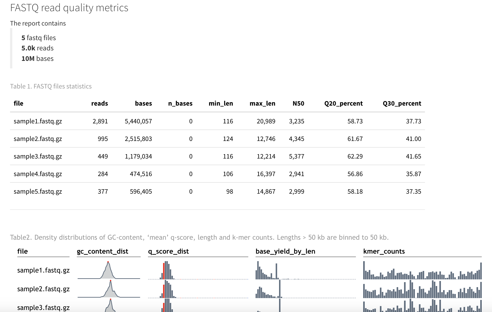

# rfaster2

> Get summary metrics about fastq data in `R`.

This package exports some of the functions of the Rust program [`faster2`](https://github.com/angelovangel/faster2) in `R`. It uses Rust code (thanks to the [`extendr`](https://extendr.github.io/) library) and is therefore pretty fast.

## Install

If you don't have Rust, run this in your shell:

``` bash
curl --proto '=https' --tlsv1.2 -sSf https://sh.rustup.rs | sh
```

And then in `R`:

``` r
remotes::install_github('angelovangel/rfaster2')
```

If you don't want to setup Rust, use compiled GitHub releases. Binary packages are available for Linux (x86_64)

``` r
install.packages(
  "https://github.com/angelovangel/rfaster2/releases/download/v0.2.0/rfaster2_0.2.0_R_x86_64-pc-linux-gnu.tar.gz",
  dependencies = TRUE
)
```

and for macOS (aarch64, a.k.a. Apple Silicon)

``` r
install.packages(
  "https://github.com/angelovangel/rfaster2/releases/download/v0.2.0/rfaster2_0.2.0_macos_aarch64.tgz",
  dependencies = TRUE
)
```

The following additional libraries are needed:

```         
dplyr
htmlwidgets
kableExtra
knitr
rmarkdown
scales
sparkline
```

## Usage

All `rfaster2` functions have the `fq_` prefix. All of them take a path to a fastx file (fastq or fastq.gz) and return various metrics - reads, bases, N50, quality scores...

``` r
# get 'mean' qscores for the reads in a file
fq_quals(infile = path/to/fastqfile, phred = TRUE)

# get summary for a file (as a list object)
fq_summary(infile = path/to/fastqfile)

# get a data frame with statistics for a list of fastq files 
f <- list.files('path', pattern = 'fastq', full.names = T)
lapply(f, fq_summary) %>% dplyr::bind_rows()
```

An html report about all the fastq files in a directory can be generated using the `fq_report` function:

``` r
fq_report('path/to/fastq/files')
```

The html report will be saved in the R session working directory.

